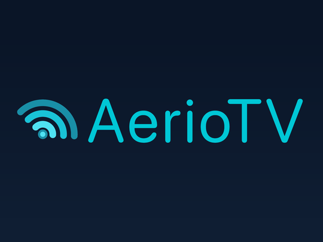

# AerioTV for Roku



Native BrightScript/SceneGraph port of AerioTV for Roku. So far, it has been
**tested only using the Roku Streaming Stick 4K with Dispatcharr 0.31.0**.
The product goal is Apple TV visual/behavioral
parity with deliberate Roku remote adaptations. Distribution starts with personal
sideloading. The deployment consists of the Roku and the existing Dispatcharr
instance; no additional service/container is required by this build.

The [source-level parity audit and remaining-work inventory](docs/PARITY-AUDIT.md)
records the original baseline. The feature table below describes this release.

## Download the testing build

**[Download v0.3.81 — testing prerelease](https://github.com/EndofLineTech/AerioTV-Roku/releases/tag/v0.3.81)**

Under **Assets**, download **`aeriotv-roku-v0.3.81.zip`**. Keep it zipped.
Do **not** download GitHub's automatically generated **Source code (zip)** for
installation; that is the repository, not the Roku application package.

You do not need Node.js, npm, Git, or a compiler to install the release ZIP.
This is a sideloaded testing preview, not a Roku Streaming Store release.

### New since v0.3.80

- **Server DVR:** Recording Now, Scheduled, Recent and Series Rules share a
  single list with clear section headings. Growing Dispatcharr recordings
  expose Roku's native FF/REW availability window; completed files retain
  native seek controls. Supported seek depth depends on the recording source.
- **Reliability and navigation:** bounded AAC decoder retry, saved-connection
  recovery, VOD sort choices and improved guide-options focus labels.

### Also included since v0.3.37

- **Connections:** up to four named connection slots with scoped credentials,
  optional channel profile, safe API headers and explicit re-login. Direct M3U
  with bounded XMLTV and session-only Xtream live/VOD/archive adapters are
  available for supported feed/transport variants.
- **Server DVR:** browse, schedule, manage and play permitted Dispatcharr
  recordings, including guarded resume and supported growing files. No local
  recording service is added.
- **Presentation:** source-informed pill navigation, poster-led VOD, rounded
  settings and player controls, appearance/text preferences, a first-run welcome
  screen, and model-tested guide density/visibility settings.
- **Testing status:** this is a development prerelease. Current-build physical
  picture/sound after DVR seeking is not confirmed. The target's missing custom
  Audio Guide speech is an accepted platform limitation. Multiview is not
  implemented; Roku's `roMultiDecode` SDK access is pending.

### Included since v0.3.8

- **Movies and TV Shows:** paged catalogs, search/categories/sort, episode browsing,
  Continue Watching, watchlists, hidden titles and authorized source-version selection.
- **Catch-up and Restart Program:** replay eligible completed programs or restart
  a currently airing program when the provider archive is available.
- **Provider-backed live rewind:** up to 60 minutes since tuning on supported
  catch-up channels, with explicit **Go Live** and unavailable-window handling.
- **Seek controls:** configurable 1/2/5-minute skips and held timestamp/marker
  preview, with explicit commit/cancel and pause preservation.
- **Navigation and Settings:** Live TV / VOD / Settings in the guide header,
  categorized settings, and catch-up history icons beside channel numbers.
- **Reliability:** incremental guide loading, bounded metadata caching, local
  startup/midstream recovery, contextual Retry and sanitized diagnostics.
- **Hold OK** opens app player options; fullscreen star remains Roku-owned.

[v0.3.81 release notes and known limitations](docs/RELEASE-0.3.81.md)

## Roku vs. Apple TV and Android TV

**Roku includes Dispatcharr live TV, the guide, movies/series, server DVR,
supported direct Xtream/M3U connections and conditional catch-up/restart/rewind,
but not full upstream feature parity.** Multiview and cross-device sync remain
unimplemented. Rewind uses provider archives; it is not a guaranteed local buffer.

| Feature | Roku — v0.3.81 preview | Apple TV — upstream | Android TV / Google TV — upstream |
| --- | --- | --- | --- |
| Dispatcharr connection | **Available** — API key or dashboard login | Available | Available |
| Direct Xtream Codes connection | **Implemented for tested variants**; session-only credentials, bounded live/VOD/archive | Available | Available |
| Direct M3U + XMLTV connection | **Implemented for supported URL feeds**; raw gzip and oversized feeds remain limited | Available | Available |
| Live TV and EPG grid | **Available** | Available | Available |
| Favorites, group visibility and channel sorting | **Available** | Available | Available |
| Mini-player while browsing the guide | **Available** — same playback session | Available | Available |
| Audio/subtitle selection and sleep timer | **Available**, limited to tracks Roku exposes | Available | Available |
| Video scaling | **Fit / Fill / Stretch**; source-aspect setting may be required | Available | Available |
| Programme reminders | **Foreground alerts only**, while the app is open | Saved reminder state; background delivery not established on tvOS | Documented reminders; notification delivery depends on device |
| Movies/series and Continue Watching | **Available** with supported provider renditions; local progress/watchlists | Available with supported providers | Available with supported providers |
| DVR scheduling and recording management | **Implemented against Dispatcharr server DVR**; final-build physical checks pending | Available; server-side DVR uses Dispatcharr | Available; server-side DVR uses Dispatcharr |
| Multiview | **Not implemented** | Up to 9 streams, device/resource dependent | Up to 9 streams, device/resource dependent |
| Live rewind / completed-program catch-up | **Provider-backed** catch-up, Restart and up to 60 minutes of history since tuning on eligible channels | Implemented, subject to settings/provider support | Not verified in this comparison |
| Cross-device preference/watch-progress sync | **Not implemented**; local Roku preferences only | iCloud | Optional Google Drive sync |
| Playback compatibility | Native Roku MPEG-TS player; optional existing server AAC profile | Apple/native and mpv playback routes | Media3/ExoPlayer plus bundled FFmpeg audio decoders |
| Distribution | **Developer Mode ZIP / testing prerelease** | App Store, TestFlight and upstream sideload releases | APK releases; upstream documents invite-only Google Play testing |

"Available" in the upstream columns means documented or source-established,
not independently device-tested here. Store builds can differ from repository
versions; provider permissions and device capabilities still apply. "Not verified"
is not a claim that the feature is absent. Mobile-only features are not assumed
to be available on a TV.

Upstream comparison sources reviewed 2026-09-19; Roku column updated for v0.3.81:
- [Apple upstream README, pinned revision](https://github.com/jonzey231/AerioTV/blob/8d5818456e0f4421d93b8ff120ad878d63331091/README.md)
  and the [source-level tvOS audit](docs/PARITY-AUDIT.md). The audit's Roku column
  is an older baseline; the table above describes this release.
- [Android upstream README, pinned revision](https://github.com/jonzey231/AerioTV-Android/blob/7bf4a2ddad9dd6d58152eee5b4eee08873c1da3b/README.md).
- [Roku device evidence and limitations](docs/DEVICE-VALIDATION.md).

## What you need

- A Roku player or Roku TV with a remote. The tested baseline is a **Streaming
  Stick 4K (3820RW2), Roku OS 15.3.4, at 1080p**; other models are not yet verified.
- A Roku account. Follow Roku's [free developer enrollment](https://developer.roku.com/enrollment/standard)
  and [official Developer Mode setup guide](https://developer.roku.com/docs/developer-program/getting-started/developer-setup.md).
- A computer with a web browser on the **same local network as the Roku**.
- A running **Dispatcharr server** reachable from the Roku, with working channels
  and an account/API key. This build has been tested with Dispatcharr **0.31.0**.
  No additional AerioTV service or container is required.

Roku allows **one sideloaded development app at a time**. Installing this ZIP
replaces the development app already in that slot, if any.

## Install on your Roku

### 1. Enable Developer Mode

1. Turn on the Roku and start from its **Home screen**.
2. On the remote, tap this sequence in order, at a steady pace:

   **Home → Home → Home → Up → Up → Right → Left → Right → Left → Right**

   These are individual button presses; do not hold the buttons down.
3. The **Developer Settings** screen should appear. Write down the Roku's
   displayed IP address/web address.
4. Choose **Enable installer** / **Enable installer and restart** (wording varies
   by Roku OS), accept the Developer Tools License Agreement, and set a
   **developer password** when prompted. The password is case-sensitive.
5. Let the Roku restart. Developer Mode is now enabled.

If you need to find its IP address again, use **Settings → Network → About**.
If Developer Mode is already enabled, proceed to the next step.

### 2. Open the Roku's installer in your browser

1. On your computer, open **`http://<your Roku IP>`**, replacing `<your Roku IP>`
   with the address from step 1. For example, if it is `192.168.1.50`, open
   **`http://192.168.1.50`**.
   Enter **HTTP**, not HTTPS. This is the Roku's address, not Dispatcharr's.
2. When the browser asks for credentials, use:

   | Field | Value |
   | --- | --- |
   | Username | **`rokudev`** |
   | Password | The developer password you just set on the Roku |

   This password is **not** your Roku account password or Dispatcharr password.
3. You should see the **Development Application Installer** page.

### 3. Upload and install the release ZIP

1. Click **Upload** / **Choose File** and select **`aeriotv-roku-v0.3.81.zip`**.
2. Click **Install** or **Install with zip**, depending on the installer version.
   Some versions also offer **Install with squashfs**.
3. Wait for **Install Success**. AerioTV should launch on the TV automatically.
4. To open it later, find **AerioTV Roku Preview** on the Roku Home screen,
   usually near the end of the app list.

Upload the ZIP itself—do not extract it first. The release package has its
`manifest` at the ZIP root. If your browser automatically extracts ZIP downloads,
disable that behavior or download it again using a browser that preserves ZIPs.

### 4. Connect to a source

On a first install, press **OK** at Welcome to open setup. On the Roku's
connection screen:

1. Select or add a connection. Dispatcharr is the default; **Connection →
   Manage saved connections** can also add a direct M3U/XMLTV or Xtream slot.
2. For Dispatcharr, enter your **base URL**, such as `http://<dispatcharr-host>:9191`.
   Use the final URL your Roku can reach; `localhost` would refer to the Roku,
   and a Docker-internal hostname may not be reachable from your home network.
3. Choose **API key** or **Dashboard username and password**, then enter the
   credentials for your Dispatcharr account. These are **Dispatcharr dashboard
   credentials**, not provider/Xtream Codes credentials or the `rokudev` login.
   For direct M3U, supply a permitted playlist URL and optional XMLTV URL;
   for direct Xtream, enter its URL and session-only username/password.
4. Choose whether to enable **Remember API key** for Dispatcharr. See [connection storage](#connection-storage)
   for what is saved on the device.
5. Select **Connect**. The guide opens after the authorized lineup loads.
6. Highlight a currently airing channel/program and press **OK** to watch.

## Essential controls and known testing limitations

- **Tap OK** shows/hides live player information. **Hold OK about one second**
  opens app player options. **OK → Up (or Down) → Options** is the alternative.
- **Fullscreen `*` belongs to Roku.** Guide/mini-guide `*` opens app guide options.
  The retired fullscreen-star diagnostic is not included.
- **Back** from bare fullscreen minimizes the same player into the guide;
  Back or Play expands it. To end playback, select **Stop playback** in player
  options or mini-guide options.
- **Up/Down** change channels in fullscreen (default: Up next, Down previous).
  **Left** opens Channels, **Right** returns to the last channel, and **Replay**
  opens Recently Watched.
- In pills/sidebar guide layouts, **hold Left** to focus groups from any row.
- To reach the guide header: hold Left directly in Modal; in Sidebar, then Left
  from groups; in Pills, then Up from groups. Select **VOD**, **DVR** (on permitted
  Dispatcharr accounts), or **Settings** there.
- **DVR** shows Recording Now, Scheduled, Recent and Series Rules under separate
  subheadings in one scrolling list. Active recordings appear first; **Replay**
  refreshes server items. Select a row with **OK** for facts and available playback.
- Recordings use Roku's native FF/REW timeline. During a Dispatcharr recording,
  the available seek window grows from the recording start; press Play to resume
  from a selected position. Availability and playback continuity depend on the
  server's HLS stream. Completed and stopped files retain native transport.
- For catch-up/Restart, open **Program details** and select the separate archive
  or Restart action. **Watch channel LIVE** remains a distinct choice.
- During live playback, **Rew** or player options → **Rewind history (provider)**
  opens available history since tuning. Unsupported/too-early entry leaves live
  playback running. Provider delay or failure can produce **Archive not yet available**.
- In archive/Restart/rewind: tap Rew/FF to skip; hold to preview a timestamp,
  release, then **OK/Play** to commit or **Back** to cancel. **Up → Go Live**
  returns to the same live channel. Set intervals in **Settings → Player** or
  **Up → Skip interval**. VOD uses Roku's native transport controls.
- **AAC compatibility needs an existing active copy-video/AAC output profile**
  visible to the Dispatcharr account. The app does not create server profiles.
  Always AAC waits for discovery and offers explicit alternatives if unavailable.
- Startup and recoverable midstream failures have bounded local retry budgets;
  terminal failures offer Retry/Return. Recovery cannot make an unavailable
  provider rendition playable.
- **Switch stream source** is an admin action affecting everyone watching that
  shared Dispatcharr channel; the menu explains this before confirmation.
- Hide picture is **foreground listening only**.
- Rewind is limited to eligible provider archives and whole-minute requests, not
  local recording. Channel changes begin a new since-tune range; inactive channels
  do not keep ingesting media. Provider windows can be missing, delayed or end early.
- Some VOD providers/renditions can fail even when another copy works. Authorized
  accounts can use **Choose source version**. Missing descriptions remain a known
  limitation; English is preferred when available, without invented translation.

## Update or remove the sideloaded app

- **Update:** download a newer release's application ZIP, return to the same
  browser installer, upload it, and install it over the current development app.
  You may need to reconnect if saved app data changes or is removed.
- **Remove:** use **Delete** in the Development Application Installer.
- **Identical package:** Roku may reject reinstalling the exact same ZIP as an
  identical version. If it is already installed, open it from Home; delete and
  reinstall only if you actually need to reset the development installation.

## Troubleshooting installation

| Problem | What to check |
| --- | --- |
| Developer Settings never opens | Start at Home and repeat the exact remote sequence above, using separate taps. |
| Browser cannot reach the installer | Confirm the Roku IP, Developer Mode and same-network connectivity. Guest Wi-Fi/client isolation or a VPN may prevent access. Use `http://`, not `https://`. |
| Installer login fails | Username is `rokudev`; use the case-sensitive password created in Developer Mode, not another account's password. |
| Missing manifest / invalid ZIP | Download the named application asset, not **Source code (zip)**; do not upload an extracted folder or a ZIP with an extra outer directory. |
| Compilation/install error | Record the exact installer error and release version; confirm you selected the intended release asset. |
| App installs but cannot connect | Check the Dispatcharr URL from the Roku's network and use Dispatcharr dashboard credentials/API key. |
| Picture but no sound | Player options → Audio compatibility. AAC requires the existing server profile described above; unavailable-profile errors have Automatic/Direct/Cancel choices. |
| `*` opens Roku settings | Expected in fullscreen. **Hold OK** for app options, or use **OK → Up → Options**. |
| Archive/rewind unavailable | Check channel catch-up support and provider availability; retry later or explicitly choose Go Live. |
| Movie/episode source fails | If authorized, use title details → Choose source version. A working alternative does not repair the failing provider. |

## Feedback

If you encounter a problem, share **release version, Roku model/OS,
Dispatcharr version, steps to reproduce, and expected/actual behavior**, plus a photo
or exact error text when useful. Omit passwords, API keys and provider URLs.

<details>
<summary>Development notes, work tracking, and historical releases</summary>

## Work tracking

**Beads is the authoritative execution backlog.** Epics contain child stories,
bugs, investigations, decisions and verification work. User-facing stories use
the standard `feature` type with the `story` label. Audit references are searchable
labels such as `audit-p09`; platform investigations also carry `spike` or
`feasibility` labels. Priorities express ordering, not a committed sprint schedule.

```sh
bd ready --json
bd list --type epic --json
bd list --parent <epic-id> --json
bd show <issue-id> --json
bd list --label audit-p09 --json
```

The audit and port plan are reference snapshots, not parallel status boards.
Update acceptance evidence, dependencies and work status in Beads. This project
uses the installed Dolt-backed Beads workflow; remote synchronization setup is
tracked in the delivery epic.

The GitHub repository is `EndofLineTech/AerioTV-Roku`; development is on `dev`.
The tracked `.beads/backlog-snapshot.json` archives issues, dependencies, comments
and labels from the local Dolt database. Refresh it with
`node scripts/snapshot-beads.mjs` before committing backlog changes. It is a
reviewable backup, not automatic Beads synchronization; the live Dolt database
and runtime files are ignored by Git. A remote Dolt destination and restore drill
remain tracked under `AerioTV-Roku-rgs.11`.

## 0.3.28 — Accepted testing preview

Adds VOD browsing/playback/state, catch-up/Restart, approved provider-backed rewind,
held seek preview and configurable skips, playhead-relative information, a Settings
hub, and the corrected native `ts` reader hint. Incremental metadata loading and
bounded recovery/cache/diagnostic paths are included. Forty-four automated suites
and compiler checks pass; the maintainer reported all 50 consolidated physical
checks PASS. Provider/metadata limitations remain documented in the release notes.

The sections below are historical build-time records, not current availability
or pending-test statements. See the current feature table and controls above.

## Development 0.3.11 — Hold OK player options (historical)

The development build replaces fullscreen-star interception with **hold OK for
about one second**. A short OK tap still shows/hides information, and the opening
hold/release cannot activate a menu item. Guide star remains available. Fullscreen
video stays full-size, and the experimental star menu is retired. These changes
were not included in v0.3.8; they are included in the current release.

## 0.3.8 — Tester distribution and upstream branding

Adds the upstream Apple TV AerioTV icon adapted to Roku launcher/splash sizes,
installation instructions, and a sourced platform comparison. Playback behavior
matches 0.3.7. Artwork source, license and regeneration steps are retained in
`images/upstream/` and `scripts/generate-branding.py`.

## 0.3.7 — Strict AAC startup discovery

Always AAC and explicit AAC retries now wait up to 20 seconds for the existing
account-authorized profile before opening a new stream. Profile discovery is
published immediately after account validation, ahead of optional channel facts.
There is no silent direct fallback for these requests. Back/Stop, retuning and
account changes cancel pending work. A discovery failure offers explicit
Automatic, Direct or Cancel choices; Cancel preserves Always AAC.

The startup watchdog starts only after media playback is requested. Native
validation observed deferred startup with no media content, then AAC-profile
playback reporting `aac_adts`, plus timeout-dialog cancellation without retune.

## 0.3.6 — Bounded startup recovery

A confirmed native `buffering is stalled` error before first playback, or a
25-second startup watchdog expiry, retries this local player once. The retry
clones the exact playback content, preserving its URL, credentials and output
profile. It does not request a shared-source switch/Stop. A second failure ends
with an error. Successful/paused playback, explicit Stop, retuning and account
teardown prevent stale startup recovery. The budget survives automatic AAC
fallback within a tune and resets for a new explicit tune.

Buffering stalls are no longer labeled as proof of an unsupported codec. The
Always-AAC-before-profile-discovery race is separately tracked as `ihp.34`.

## 0.3.5 — Direct diagnostic case selection

The diagnostic menu now lists all six cases for direct selection. Scene key-up
routing is fixed, and a bounded debounce prevents missing release events from
permanently blocking Fast Forward. Cases 1 and 2 recorded zero star presses in
the maintainer's 0.3.4 test. Later cases remain under investigation.

## 0.3.4 — Focused fullscreen Options diagnostic

Player options now includes **Fullscreen * diagnostic (temporary test)**.
Enter through OK -> Up -> Options. It compares focus, post-start override and
video geometry on the existing stream, with physical star press/release counters.
Fast Forward/Rewind changes cases; Back exits and restores normal geometry.
It is opt-in, session-only, and is not a claimed interception fix.

## 0.3.3 — Immediate guide layout and pills access

Immediate layout switching and group access passed maintainer acceptance.

Layout selection explicitly replaces the live navigator presentation and clears
stale group focus. Modal, Pills and Sidebar should switch without relaunch.
**Hold Left** from any guide row focuses groups in either pills or sidebar mode;
a short Left tap still navigates the timeline on release.

## 0.3.2 — Remote input and guide retest

- Selection-event guards prevent the initiating OK from waking hidden picture
  or tuning the guide after a layout picker closes.
- Bare playback focuses the custom Video input owner and forwards keys to the app.
  Physical fullscreen star interception still needs confirmation on the target.
- Pills have an explicit CHANNEL GROUPS heading and range count. Scripted rendering
  is verified; the reported normal-menu-path failure stays open pending retest.
- Hold Left for 400ms to enter the docked sidebar; a short tap navigates time on
  release. Star opens guide options from either group navigation mode.
- Held guide Up/Down accelerates after 1.5 and 3 seconds, stops on release, and
  defers metadata loads while scrolling.
- Default real-group order uses each group's lowest numeric channel number;
  alphabetical/manual modes remain available.
- Player, guide and browser hints use button keycaps. Browser backgrounds and
  unselected rows are translucent while focused rows retain strong contrast.

## 0.3.1 — Acceptance fixes (historical candidate)

This historical candidate addressed the 12 reported 0.3.0 failures/caveats.

- Video-owned Options handling; OK → Up or Down → Options is also supported.
- Hidden picture suppresses the video plane and captions while retaining audio;
  sleep cancellation is directly available in player and mini-guide options.
- Browser logos use a bounded app-session local cache (32 files / 16 MiB).
- Group settings survive parsed-preference key casing; top pills and a docked
  sidebar have explicit selectors. Default group order matches Dispatcharr 0.31's
  alphabetical guide order, and group-list/footer geometry is separated.
- Guarded local decoder recovery follows detected post-switch timestamp stalls;
  admins can also select **Recover frozen picture (this player)**. A temporary,
  bounded extra server client holds the upstream during restart. This changes the
  local playback session; it never requests a shared-channel Stop.

Native probes verified local decoder restart back to playing with unchanged
upstream URL, hidden-picture audio advancement/pause/restore, actual layout-menu
selection, and eight cached logos reopening in 231 ms versus 7,020 ms cold.
Physical star interception, actual frozen-source recovery, other-viewer continuity,
and perceived picture/caption behavior required further physical verification.

## 0.3.0 — Live TV compatibility and Guide discovery

This implementation pass combined the Live TV and Guide epics. Physical
acceptance is separate from automated and scripted-device evidence; Beads
records the outstanding work.

### Live TV changes

- **Automatic audio compatibility:** if native playback reports no audio, retry
  this client once with an existing active FFmpeg copy-video/AAC output profile
  discovered from Dispatcharr. Successfully repaired channels are remembered per
  account. Direct and Always AAC choices are in player options. The app does not
  create profiles, change the shared upstream or introduce a new service. A retry
  is a client retune and waits while menus/controls are in use.
- **Held Up/Down:** previews repeat after 400 ms, then every 150 ms; release
  coalesces a single tune. Context changes cancel the hold; a 10-second guard
  prevents an indefinitely stuck key.
- **Browser logos:** eight poster nodes and their HTTP agent are reused across
  openings within the same connection. Failed images can retry on reopen.
- **Clock format:** System/12-hour/24-hour preferences apply to guide, player,
  details and search. Explicit UTC references remain 24-hour.
- **Channel search:** searches the full authorized lineup; Clear restores the
  selected group. A direct-number action remains scoped to the visible list.

### Guide controls

Open guide **`*`** and scroll to **Guide settings**, **Manage groups**,
**Collections**, **Favorite ordering**, or **Program reminders**.

- Show/hide groups; Default/alphabetical/manual order; startup group independent
  from the last browsed group. A fallback prevents an all-hidden navigation trap.
- Top group pills or a sidebar overlay with debounced preview. Up from the first
  channel enters navigation; Down/OK (pills) or Right/OK (sidebar) returns to the
  grid. The modal group-list fallback is always available.
- Number/name/ID channel sorting, stable decimal ordering, manual favorite order
  and a Recently Watched guide group. Player browser ordering follows these
  preferences while Recent remains chronological.
- Up to 20 named collections with add/remove selected channel, rename/delete,
  collection/member ordering and First/Last selector placement. Membership uses
  compact channel IDs and is account-scoped. Registry limits still apply; failed
  persistence is reported rather than silently claimed successful.
- Fast Forward/Rewind page through channels, Jump to Top, and a decimal-aware
  Go to channel number keyboard.
- History/future depth choices of 1/3/7/14/30 days. “All available” explicitly means
  bounded to 30 days each way. The three-window resident guide cache is independent
  of browsing depth. Date jumping groups Today/Upcoming/Previous and preserves UTC
  references for repeated DST hours.
- Scoped lineup refresh preserves selection/time and ongoing authorized playback.
  A channel removed from the authorized lineup is stopped explicitly. Guide/detail
  cache clear and refresh do not retune otherwise-valid playback.

### Program information, artwork and reminders

Guide data retains reported New/Live/Premiere/Finale and episode facts. Detail
enrichment is debounced, coalesced and cached in at most 32 entries for five minutes,
with bounded failure backoff. Selected programs and a limited visible set are
enriched progressively; the entire lineup is not fetched program-by-program.

Rich details include available rating/year/quality/language/country/cast and
artwork, with separate Watch LIVE and reminder actions. Per-badge controls and
category colors/rules are in Guide settings. Default precedence begins
Kids > Sports > News > Movies, followed by additional source-inspired buckets.
Focus overrides category tint; unavailable metadata remains neutral.

Artwork preserves aspect and bounded decode sizes. Dispatcharr headers are applied
only to same-origin artwork; external HTTPS artwork uses a separate plain agent.
Optional TMDB fallback is off by default. Its v3 API key can be tested/saved in the
device registry; fallback opt-in is per account. It searches program titles only
when indexed detail data lacks a poster and uses only a single exact-title match.
Ambiguous matches, missing keys and failures leave provider text usable. The
approved TMDB logo and non-endorsement attribution accompany TMDB artwork.

Up to 50 account-scoped reminders alert once in the foreground, about five minutes
before a program starts (or late if opened during an unnotified airing). Details
and the reminders menu support cancellation; guide cells show REM. Refreshed
windows reconcile schedule changes and suppress reminders whose saved program
disappeared; expired/unauthorized entries are cleaned up. No background delivery
is promised.

### Verification

Fourteen automated suites cover models, storage adapters, controller handlers and
the source Task flow. Native probes verified AAC decode on the affected ESPN
channel, healthy-channel direct audio, guide settings/pills/sidebar/details focus,
collection membership and reminder cancellation, held-key tune coalescing, and
poster-node reuse. The final package excludes test code and diagnostic autoplay.
See [device evidence](docs/DEVICE-VALIDATION.md) for limitations and remaining
physical checks, including a separately tracked unexplained device restart.

## 0.2.13 — Player-menu, transport-focus and mini-caption fixes

The Video now requests Options-key override and is non-focusable. Bare playback
uses a dedicated input Group whose keys bubble to the Scene. This corrects the
native focus handoff observed when trying to focus the Scene itself. The app menu
is branded **AerioTV player options**, with another entry in the mini-guide's
options menu. OK → Up or Down → Options remains an alternate route.

Explicitly opened information stays visible until dismissed; the automatic
tune-in banner still expires after eight seconds. Entering transport reasserts
visibility and focus, and keys reaching the Scene while controls are active are
routed back to them. Native scripted Up/Left/Right transitions now return to the
input Group correctly and re-enter transport consistently.

The mini-player is 400×225 at [1424,16]. Its single-line caption ends at y=267,
above the guide timeline at y=270. A device screenshot confirms the separation.
Twelve suites and compiler/build checks pass. Installed 0.2.13 launches normally;
temporary native probe code is removed. Physical star-key interception and the
reported sequences required further physical verification.

## 0.2.12 — Source-switch continuity checks

Source changes now compare the original Dispatcharr client identities against
the confirmation snapshot. Messages distinguish clients still listed, clients
missing, and insufficient data. Equal client counts alone are not treated as
continuity evidence; client identifiers/IPs stay out of UI results and logs.
This is a point-in-time check, not proof of uninterrupted viewing.

Selecting the URL-confirmed active source sends no mutation. Invalid operations,
changed account identity, revoked admin permission and non-member sources are
rejected; mutation failures are not automatically retried. Confirmation polling
respects the overall Task deadline. Source transitions also cancel old server
metadata requests so late callbacks cannot repopulate obsolete Stream Info.

Twelve automated suites pass, including the actual source Task body with scripted
HTTP responses. A separate native read-only probe successfully fetched six member
sources and one active client on the target device. Real source mutation and
multi-viewer continuity remain part of final acceptance. The diagnostic autoplay
was removed; the installed 0.2.12 app launches normally into the guide.

## 0.2.11 — Scaling preview and server-reported stream details

Installed on the target Stick. **Player options → Video scale preference** offers
native Fit plus Fill/Stretch previews using a clipped video viewport. Fill and
Stretch ask for this channel's source aspect (4:3, 16:9 or 21:9) when unknown;
that override is account-scoped and saved per channel. Unconfigured channels fall
back to Fit. The preferred mode applies to fullscreen and mini-player without
replacing the Video/content session. Final visual crop/distortion acceptance is
still required; the native fixture verified transforms, clipping and playback.

Stream Info now requests existing Dispatcharr status metadata for admin accounts
and shows **Server resolution**, **Server source frame rate**, video/audio codec
and pixel format separately from native decoder facts. These values depend on
server metadata availability and may describe cached upstream data. Pixel
dimensions are not silently treated as display aspect, because SAR/DAR matters.
See [aspect/metadata research and native fixture procedure](docs/VIDEO-ASPECT-RESEARCH.md).

Eleven automated suites and compiler/package checks pass. Native installation,
launch and capability refresh succeeded. The normal app is installed after the
temporary test-pattern package; no fixture autoplay is present in it.

## 0.2.10 — Measured native diagnostics and player polish

Installed on the target Stick. Stream Info now includes the native rendered,
dropped, repeated-frame and stream-error counters measured on OS 15.3.4. Counter
snapshots are cleared on retune/Stop and repopulated by current playback events.
The tested continuous MPEG-TS stream reported no native resolution or source
frame rate, so those fields remain explicitly unavailable.

The mini-guide footer now describes Fullscreen/Stop correctly. Channel and recent
rows distinguish missing/loading/unavailable program data and label cached titles.
Channel surfing outside the guide's current filter explains how to resume browsing.
Source-change loading explains that closing its menu does not undo a submitted
shared-source request.

A temporary native playback probe verified `playing` through minimize/expand and
Hide picture with unchanged ContentNode identity and increasing render counters.
A shortened sleep deadline stopped playback once and cleared the cover. This
does not establish perceived audio/video quality or Dispatcharr client identities;
those remain in the deferred acceptance record. Probe autoplay/timers were removed
before the final package, which launches into the guide normally.

Ten automated suites, compiler checks and packaging pass. Fit/Fill/Stretch
(`ihp.10`) is blocked pending a supported, measured hardware-video mapping. The
epic remains open for that platform gap and final physical acceptance.

## 0.2.9 — Foreground listening and nested player menus

Installed on the target Stick, including the 0.2.8 program-search and sign-in
policy changes. Native compilation/launch and Dispatcharr capability refresh
succeeded. All ten automated suites pass; physical acceptance remains deferred.

**Player options → Hide picture (foreground listening)** covers the existing
video with black. The explanation fades after six seconds. Play/Pause and the
sleep timer remain active; a navigation key restores the picture and is consumed
through its release so a held wake key cannot immediately change channels.
Stop, errors, retuning and mini-player transitions remove the cover. This is a
foreground presentation mode: keep AerioTV open. The full video stream is still
received/decoded; background playback and TV power control are not provided.

**Back** now returns from player submenus to the parent menu, restoring the
parent option's focus. Back from source-switch confirmation returns to the source
list. **`*`** dismisses the menu to playback. Reopening a pending source operation
shows its loading state instead of appearing unresponsive.

## 0.2.8 — Program search and remembered sign-in policy

In the guide, open **`*` → Search programs → Title or Description**. Submit a
2–120-character query to search server-indexed airings from three days back to
seven days ahead. Dispatcharr's quoted phrases and AND/OR operators are supported.
Results show the effective channel name/number, local airing time, Past/Now/Upcoming
state and focused-program description. **OK** opens that channel/time in the guide;
it does not tune immediately. Channel filters are cleared only when needed to
show a selected result outside the current filter.

Results use explicit Next/Previous pages with 50 server programs per request and
a 200-airing display cap per page. Requests run only on submission/page actions;
Back, editing, leaving the guide or changing accounts cancels the current Task.
The existing channel-name/number search is separate. Returned channel IDs and EPG
mappings are checked against the connected lineup. Only programs indexed by
Dispatcharr's search endpoint can appear; dummy/unindexed schedules and effective
EPG overrides not represented by that endpoint may be absent.

**Remember API key** now persists independently of the key. Off immediately
removes the saved key, stays Off after relaunch, and prevents loading a residual
saved key. On stores a key only after a successful connection. Forget removes
connection/account data while retaining this device policy. Existing installations
without a policy retain the previous On default; malformed policy values use Off.
Storage failures are reported rather than silently claiming the choice was saved.

Nine model suites and compiler/build checks cover the local build. Native search,
keyboard/focus, paging, and registry-relaunch acceptance are deferred in Beads
(`AerioTV-Roku-5tg.11`, `AerioTV-Roku-b17.3`) until device testing is available.
These additions are included in the installed 0.2.9 package.

## 0.2.7 — Live TV navigation preview

This development build adds account-scoped recent/previous channels, an in-player
Channels/Recently Watched browser, a corner mini-player using the existing Video
session, focusable transport actions, and a 30/60/90/120-minute sleep timer.

During playback, **Up = next / Down = previous** by default (configurable in
player options). **Left** opens Channels, **Right** returns to the previous
watched channel, and **Replay** opens Recently Watched. **OK**, then **Down**, enters
transport controls. **Back** dismisses explicit info/overlays, then minimizes to
the guide; Back from the guide expands the mini-player. Stop is an explicit menu
action. See the [remote contract](docs/PLAYER-CONTRACT.md).

Player options also include **Stream Info** and, for verified Dispatcharr admins,
**Switch stream source**. Source switching rechecks account permission and channel
membership, explains its shared-viewer effect, and confirms the server's source
URL without reloading the Roku player. Provider URLs are excluded from menu data.
Stream Info displays native facts or `Unavailable`; decoded resolution/frame
rate mapping and Fit/Fill/Stretch remain under investigation.

All eight off-device suites and the compiler/build pass. The developer installer
accepted 0.2.7, native launch succeeded, and the capability Task reported an admin
account on Dispatcharr 0.31.0. Physical-remote, playback-continuity, source-switch,
and persistence acceptance for these additions is still pending. Evidence and
platform constraints are recorded in [device validation](docs/DEVICE-VALIDATION.md).

## 0.2.6 — Live information overlay (verified baseline)

The player now displays the channel/logo, current on-air program, synopsis,
start/end times, schedule progress, remaining broadcast minutes, and **Up next**.
It appears when tuning and can be shown/hidden with **OK**, without pausing.
During normal playback it hides after eight seconds. Metadata refreshes do not
reopen a dismissed panel or steal focus.

The guide cache continues updating during playback. Now/next and program rollover
are selected from UTC schedule times; the visible clock/progress update every
second. Missing, loading, stale, and unavailable metadata have explicit states.
The progress bar follows the broadcast schedule, including when paused; it does
not represent a seekable buffer or the paused frame's position.

The Scene now owns playback keys because Roku's focused Video node consumes OK
as pause even when its transport UI is disabled. **`*` opens an in-app audio,
subtitle-track and caption-mode menu**, replacing the native Roku Options panel.
Play/Pause, Up/Down and Back are handled separately. Caption-mode changes use
Roku's system-wide setting, as stated in the menu. Short pause/resume is not a
guarantee of the planned 60-minute rewind window.

Verified on the target Stick: the user confirmed the overlay and all controls
work; a device screenshot confirmed populated now/next information, logo,
schedule progress and paused-state indicator. Exact-boundary rollover, overlap,
gap, stale-data, long-program lookahead and track mapping have regression tests.

### Earlier playback and guide improvements

In 0.2.4–0.2.6, fullscreen playback handled **Up = previous channel** and **Down = next
channel** within the guide's current group/favorites/search results. Endpoints
do not wrap or retune the same channel; the banner identifies the boundary.
Rapid key presses are coalesced for 250 ms before tuning. Back cancels a pending
switch and returns to the currently tuned channel in the guide.

This was tested with the physical remote on the target Stick. Native logs showed
404 → 405 → 404 and additional successful switches; the user confirmed Up/Down,
Roku `*` Options and Back worked in 0.2.4. That version retained Video focus;
0.2.6 uses the app-owned player controls described above.

Live playback now uses Dispatcharr's **MPEG-TS output** with Roku's `mpegts`
reader. The previous MP4 reader failed with “Full-content response on a range
request”: it expected byte-range responses from a continuous stream. On the
target Streaming Stick 4K, the MPEG-TS test reached `playing` in about 1.6 seconds,
and the user confirmed **both picture and audio**. No server configuration or
additional service was needed. This validates the tested channel/device, not
every provider codec or the future rewind window.

The temporary autoplay smoke test has been removed. Normal launch opens the
guide; select a current program to watch. Playback failures now retain and report
sanitized native diagnostics instead of the old generic experimental-format message.

Fixes a device-confirmed crash after a successful channel load: SceneGraph task
nodes must be compared with `isSameNode()`, not `<>`. The connection and guide
completion handlers now use that API. The corrected build was installed on a
Streaming Stick 4K (3820RW2, OS 15.3.4 build 2402), and a captured device screen
confirmed a populated **1,335-channel guide** with program data and logos.

Connect is now a filled teal action button; Forget Connection is a separate
rose-outlined action. Loading shows the current stage/page and elapsed time,
with Back to cancel and a 120-second connection watchdog. Native timeout and
retry scenarios still need device acceptance; they are not implied by the
successful connection test.

Fixes the missing text reported on the initial setup screen: the shared label
helper now retains Roku's resolved default font instead of assigning a Font with
an empty URI. A regression test covers font-face preservation at the sizes used
for captions, fields, program titles and headings. The user confirmed that text
now renders correctly on the device.

Implemented (device acceptance is partial; see the checklist):

- Dispatcharr API-key or dashboard username/password setup.
- Optional saved API key and automatic reconnect; dashboard passwords are never saved.
- Account-scoped favorites, selected channel, and channel group.
- EPG landing screen: seven reusable rows, channel logos, time-scaled programs,
  focused-program details, current-time line, and missing-guide states.
- Three days back / seven days forward navigation, subject to server data.
- Three-hour guide requests, neighboring-window prefetch, a three-window LRU cache,
  five-minute freshness, request cancellation, and retry backoff.
- Groups, channel name/number search, date/time picker, Jump to Now, and program details.
- Dispatcharr 0.31 summary/effective channel values and explicit EPG-ID → TVG-ID mapping.
- Live playback using Dispatcharr's existing MPEG-TS output, with the live info
  overlay and app-owned remote controls/audio-caption options.

**This is not a completed or pixel-identical port.** Unit tests and compilation
do not establish device rendering, playback, remote behavior, or memory performance.
See [device validation](docs/DEVICE-VALIDATION.md).

Further player controls and visual polish, VOD,
catch-up/restart, and a verified 60-minute pause/rewind window remain on the
[port plan](docs/PORT-PLAN.md). Past-program details currently offer **Watch channel
live**, explicitly; selecting past guide data does not play its archive.

</details>

## Build from source (optional)

Use Node.js 22 or newer and npm:

```sh
npm ci
npm test
npm run check
npm run build
```

Sideload archive: **`out/aeriotv-roku.zip`**. The package contains the manifest,
application scripts/components, and license/attribution notices. Build tools,
tests, and credentials are excluded.

Install your locally built ZIP using the [same browser steps](#install-on-your-roku).

Maintainers can run `npm run verify` for the full automated/package gate, then
`npm run release:prepare` to build and copy a versioned ZIP plus `SHA256SUMS` into
`out/release/`. This does not publish a release or embed device/server credentials.
See the [native-device workflow](docs/NATIVE-DEVICE-WORKFLOW.md) for controlled
installation, redacted diagnostic collection, and physical-remote fallback.
Artwork regeneration is optional; see
[the source-artwork notes](images/upstream/README.md).

## Connection storage

**Remember API key** is on by default and can be turned off before connecting.
The key is stored in the Roku app registry, not Apple Keychain or an encrypted
credential vault. Login exchanges the dashboard password for the account's API
key; only that key is eligible for saving. Relaunch uses the saved key. Rotated
or revoked keys require signing in again.

Turning Remember off removes the saved key. **Forget connection** removes the
saved connection and account preferences while retaining the device's Remember
policy. Preferences and VOD state are locally account-scoped; there is no cloud
sync. Changing the URL clears the entered API key and dashboard password,
preventing accidental reuse at a different server.

## Remote controls

| Screen | Control | Action |
| --- | --- | --- |
| Connection | Up/Down, OK | Edit fields, switch sign-in method, connect |
| Connecting | Back | Cancel |
| Guide | Up/Down | Change channel while retaining selected time |
| Guide | Left/Right | Move through programs; a short Left tap navigates on release in pills/sidebar mode |
| Guide, pills/sidebar | Hold Left | Focus groups from any channel row |
| Guide | OK on current program or no-data cell | Watch channel live |
| Guide | OK on past/future program | Program details; explicit Watch channel live action |
| Guide | `*` | Details, favorites, groups, search, date/time, Now, refresh, settings |
| Guide | Instant Replay | Jump to Now |
| Guide | Back | Cancel a pending AAC tune, expand an active mini-player, or otherwise open connection settings |
| Menu | Back | Close and restore guide focus |
| Player | OK | Show/hide now/next information without pausing |
| Player | Hold OK | Open app player options; release before selecting an item |
| Player | Play/Pause | Request native pause/resume; retained duration depends on stream/device |
| Player | OK → Up/Down → Options | App options: audio, captions, scale, sleep, diagnostics and supported source controls |
| Player | `*` | Roku system options |
| Player | Rew | Open provider-backed rewind on an eligible channel |
| Player | Up / Down | Next / previous channel by default; configurable direction |
| Player options | Back | Return to parent menu or playback |
| Player | Back | Close inner chrome, then minimize to guide; use explicit Stop to stop playback |
| Archive / Restart / rewind | Tap Rew/FF | One configured whole-minute skip on release |
| Archive / Restart / rewind | Hold Rew/FF, then release | Preview a target; OK/Play commits, Back cancels |
| Archive / Restart / rewind | Up | Go Live, keep watching, or configure skip interval |
| Guide header | Settings | Categorized Live TV, Player, Appearance, General and Connection settings |

The date picker displays local calendar days and half-hour times with a UTC
reference to distinguish repeated daylight-saving hours. A missing spring-forward
hour is not offered. The guide follows the current time until you navigate
horizontally or jump to a historical/future time.

## Live playback transport

The live route is:

```text
/proxy/ts/stream/<channel-uuid>?output_format=mpegts
```

Dispatcharr 0.31.0 emits `video/mp2t`; the Roku Video node uses **`ts`**. Dispatcharr's
output name `mpegts` is not a valid Roku ContentNode reader enum. That mismatch
was corrected after a live MP4-reader failure. The tested Stick now uses the
explicit TS reader. The incompatible continuous fMP4 route is not a fallback.

The full-hour native experiment did not produce a local seekable hour. Approved
rewind instead opens owned Dispatcharr catch-up sessions at provider timestamps,
with bounded requests and explicit Go Live. Compatibility remains provider/device
dependent, even with the maintainer's completed physical acceptance.

The old 0.1 `/proxy/hls/...` candidate was removed because that route is not wired
into 0.31.0's proxy URLs. This build does not add a proxy, transcoder, recording
service, HLS endpoint, or locally retained DVR buffer. A failed compatibility test is a
decision point about existing server configuration/stream support.

## Development layout

```text
components/AerioScene.*       Setup, account persistence, player lifecycle
components/GuideView.*        Guide rendering, focus, menus, window orchestration
components/DispatcharrTask.*  Login, identity, channels, groups, EPG mapping
components/GuideTask.*        Three-hour EPG fetch and normalization
components/PlayerInfo.*       Now/next overlay, clock, schedule progress and logo
components/PlayerOptions.*    App-owned audio/caption track menus
source/DispatcharrHttp.brs    Task-thread HTTP helpers
source/DispatcharrModel.brs   Provider normalization and channel filters
source/GuideModel.brs         UTC times, guide cells, navigation, bounded cache
source/SceneUi.brs            SceneGraph creation and local-time formatting
source/PlaybackModel.brs      Verified live transport and sanitized failure messages
source/NowNextModel.brs       Schedule selection, progress and bounded lookahead
tests/                       Off-device model tests, including 1,400 channels
docs/                        Architecture, UI specification, device checklist
```

Guide limits include three resident windows, 24,000 normalized programs per
window, 128 rendered cells per row, and a global 8 MiB / 64-file metadata cache.
Authorized channels appear before independent guide mappings finish. Metadata HTTP
reads use bounded staging, cancellation and pre-parse limits; ordinary VOD reads
have a 1 MiB cap and large metadata paths use an 8 MiB cap. These are not an
absolute network-byte quota. Cachefs is discardable; catalogs/media are not stored
in the registry, and local VOD saved state is bounded to 20 entries.

`brs@0.39.0` runs off-device model and controller-adapter tests; it is not a Roku
emulator. The pinned interpreter's audited dependency exceptions and the rejected
latest candidate are documented in
[development dependency review](docs/DEVELOPMENT-DEPENDENCIES.md). These tools are
excluded from the ZIP.

## References and licensing

- [AerioTV](https://github.com/jonzey231/AerioTV), reference commit
  `8d5818456e0f4421d93b8ff120ad878d63331091`.
- [Dispatcharr v0.31.0](https://github.com/Dispatcharr/Dispatcharr/tree/v0.31.0),
  commit `bcbb68c4f054ee56383a41604cfcd7302b85da66`.
- [License notice](LICENSE.md) and [attribution](NOTICE.md).

AerioTV is Copyright (C) 2026 Logan Jones and contributors, GPL-3.0-or-later.
This port uses the same license and is an independent development preview.
