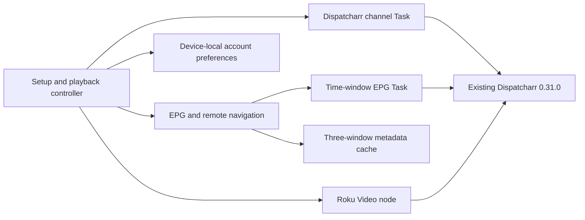

# Agreed port direction and implementation status

This is a design/roadmap snapshot. **Beads owns current execution status and
dependencies**; use `bd ready --json` and `bd list --type epic --json`. The
`parity-audit` issues reference the detailed audit's row IDs.

## Product decisions

- Roku Streaming Stick 4K, current installed Roku OS. Record exact model/build
  during device acceptance rather than treating “latest” as a fixed version.
- Dispatcharr **0.31.0**, 800–1,400 channels.
- EPG landing screen; history **3 days**, future **7 days**.
- Maximize AerioTV Apple TV visual and behavioral parity with intentional remote adaptations.
- First release: setup, Live TV and guide. Later: VOD, pause/rewind since tuning,
  restart current program, and Return to Live.
- Provider catch-up is available. In-progress restart and provider archive delay
  still require verification per channel/provider.
- Target **60 minutes** of rewind since tuning, subject to verified capabilities.
- **No additional service/container.** Roku connects to the existing Dispatcharr.
- Personal sideloading first. Apple TV hardware is unavailable for comparisons.

## Architecture

Provider models are separated from rendering; all HTTP/parsing occurs on Tasks.
Guide focus is a channel identity plus UTC instant. Seven reusable preview rows
are populated from bounded windows. Local time is a presentation concern.

Registry storage holds a remembered API key and compact preferences for the last
account. It is not an encrypted credential vault. Dashboard passwords are used
for the connection attempt and are not persisted. Multi-server persistence is later scope.

## Source evidence

### AerioTV

Pinned reference: `8d5818456e0f4421d93b8ff120ad878d63331091`.

- `Design/ThemeManager.swift`: navy `#0A1628`, card `#0D1E35`, cyan `#1AC4D8`,
  secondary teal `#1A8FA8`.
- `Features/LiveTV/EPGGuideView.swift`: tvOS rail 240 pt, preview rows 96 pt,
  basic rows 132 pt, 600 pixels/hour, program-focused navigation, hairline gaps.
- Published Apple TV screenshots inspected establish onboarding/setup styling.
  The 0.2 guide uses the source-defined **preview** layout as its working reference.
- Running-device screenshots and motion comparison remain unavailable. System
  fonts, rectangular surfaces, native dialogs and native playback controls remain
  fidelity gaps, not accepted claims of exact parity.

### Dispatcharr 0.31.0

Pinned reference: `bcbb68c4f054ee56383a41604cfcd7302b85da66`.

- `apps/channels/api_views.py`: `/api/channels/channels/summary/` provides effective
  channel values and applies visibility/account/profile rules server-side.
- `apps/epg/api_views.py` / `serializers.py`: EPG-data IDs map to TVG IDs. This
  mapping takes precedence over guessed channel names or unassigned TVG values.
- `apps/epg/api_grid.py`: `start` and `end` select overlapping programs. The grid
  supports profile scoping, not arbitrary visible-channel batches. Real rows are
  keyed by TVG ID; dummy programs use channel UUIDs.
- `apps/proxy/urls.py` and `live_proxy/views.py`: live TS/fMP4 routing exists;
  the old prototype's `/proxy/hls/...` route is not wired into this version.
- `apps/timeshift/api_views.py`: catch-up session creation checks permissions and
  provider/channel capability. Guide history alone does not establish an archive.

## Milestones

| Milestone | Status | Exit condition |
| --- | --- | --- |
| EPG implementation foundation | 0.2.2 loaded a real 1,335-channel guide on the Stick; model/compiler checked | Complete remote-navigation smoke test and UI review |
| Playback compatibility | MPEG-TS reached playing on the Stick; user confirmed picture/audio; fMP4 rejected by range reader | Expand codec coverage, sustained playback and repeated tune/stop |
| First Live TV/guide release | In progress | Full 1,400-channel acceptance, measured memory/latency, visual review, remaining player/UX polish |
| Pause/rewind and restart | Planned | Verified seek range, in-progress restart, expiry behavior, Go Live; no extra service |
| VOD | Planned | Movies/series, details, episodes, resume and Continue Watching |
| Further parity | Backlog | Additional providers/themes, DVR, corner player, platform-specific sync; prioritize separately |

## Time-shift decision boundary

Model Live, Delayed Live and Catch-up/Restart separately. Channel changes start a
new tuning session. Show controls only when the underlying media/session supports
them. Test Roku retained playback windows and existing provider archives before
selecting an implementation. Do not implement a pause indicator that silently
drops the paused position, or promise 60 minutes because the guide has history.

If existing outputs fail on Roku, present that evidence and evaluate existing
Dispatcharr configuration/stream formats. An additional media service is outside
the agreed architecture.

## Remaining release work

- Continue [device validation](DEVICE-VALIDATION.md) using the verified MPEG-TS
  transport. The tested fMP4/MP4 path is incompatible with the Roku range reader.
- Verify actual peak memory: network strings, parsed JSON, mapping catalog, three
  normalized windows, scene nodes and logo textures share the device's memory.
- Validate guide mapping/collisions against the real lineup; no channel-name guessing.
- Continue player visual parity and track-selection acceptance. Now/next info,
  OK recall, Up/Down, app-owned audio/caption options and Back were verified by
  the user in 0.2.6. App-owned focus replaces native Options to prevent Roku from
  consuming OK as pause. The overlay reports the broadcast schedule, not a DVR position.
- Tune focus transitions, accessibility, rounded surfaces, typography and artwork.
- Local registry save failures currently report through setup status; improve guide-visible reporting.
- Replace or remediate the documented development-tool dependency findings.
- Reassess source-to-source parity against the pinned upstream reference as each screen lands.

Completion requires functional and visual acceptance on target hardware. A compiled
ZIP is an implementation artifact, not evidence of complete parity or playback support.
